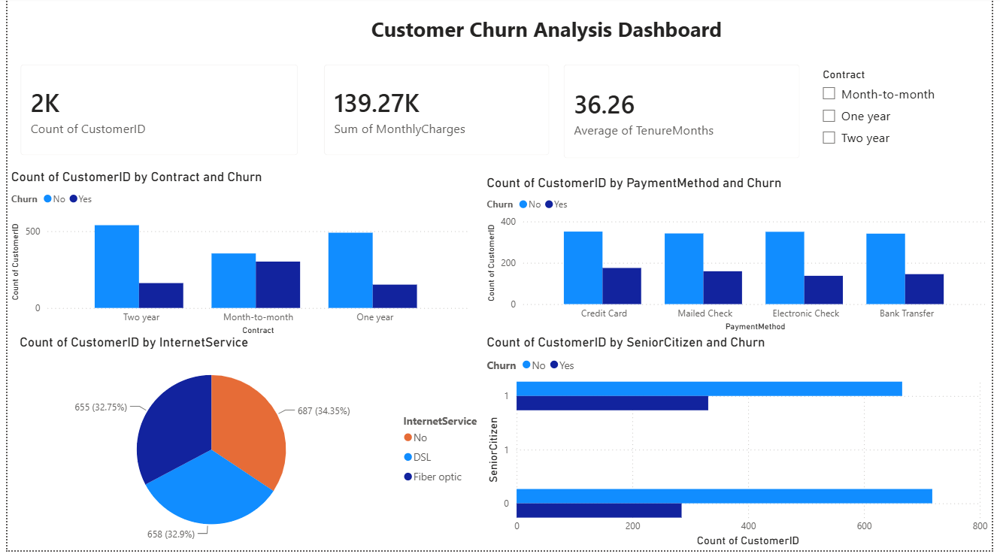

# Customer Churn Analysis Dashboard

## Overview

This project analyzes customer churn patterns using SQL, Excel, and Power BI. The objective is to identify factors influencing customer retention and provide actionable business insights through an interactive dashboard.

## Project Objectives

* Analyze customer churn behavior.
* Identify high-risk customer segments.
* Evaluate the impact of contract type, payment methods, and internet services on churn.
* Build an interactive Power BI dashboard for business decision-making.

## Tools & Technologies

* Power BI
* SQL
* Microsoft Excel
* CSV Dataset

## Dataset Features

| Feature         | Description                     |
| --------------- | ------------------------------- |
| CustomerID      | Unique customer identifier      |
| Gender          | Male/Female                     |
| SeniorCitizen   | Senior citizen indicator        |
| Partner         | Whether customer has a partner  |
| Dependents      | Whether customer has dependents |
| TenureMonths    | Number of months with company   |
| InternetService | Type of internet service        |
| Contract        | Contract duration               |
| PaymentMethod   | Customer payment method         |
| MonthlyCharges  | Monthly billing amount          |
| TotalCharges    | Total amount charged            |
| Churn           | Customer churn status           |

## SQL Analysis Performed

### 1. Customer Churn Distribution

* Calculated total churned vs retained customers.

### 2. Churn by Contract Type

* Compared churn rates across Month-to-Month, One-Year, and Two-Year contracts.

### 3. Churn by Payment Method

* Analyzed customer churn based on payment preferences.

### 4. Churn by Internet Service

* Examined the relationship between internet service type and churn.

### 5. Customer Demographics Analysis

* Investigated churn patterns among senior citizens and other customer segments.

## Power BI Dashboard Components

### KPI Cards

* Total Customers
* Total Monthly Charges
* Average Customer Tenure

### Visualizations

* Churn by Contract Type
* Churn by Payment Method
* Internet Service Distribution
* Senior Citizen vs Churn Analysis
* Interactive Contract Filter

## Key Insights

* Customers with Month-to-Month contracts exhibit the highest churn rates.
* Long-term contracts significantly improve customer retention.
* Certain payment methods are associated with increased churn.
* Customer tenure is a strong indicator of retention likelihood.

## Project Structure

Customer_Churn_Analysis/
│
├── README.md
├── sql_queries.sql
├── Customer_Churn_Analysis.pbip
│
├── dashboard_screenshots/
│ └── dashboard.png
│
├── Customer_Churn_Analysis.Report/
│
└── Customer_Churn_Analysis.SemanticModel/

## Future Improvements

* Predictive churn modeling using Machine Learning.
* Advanced customer segmentation.
* Time-series churn trend analysis.
* Deployment using Power BI Service.

## Author

**Praniti Sethi**

B.Tech Electrical & Computer Engineering
Thapar Institute of Engineering & Technology
